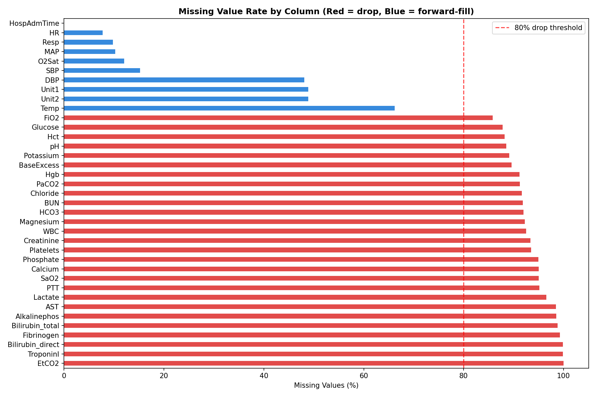
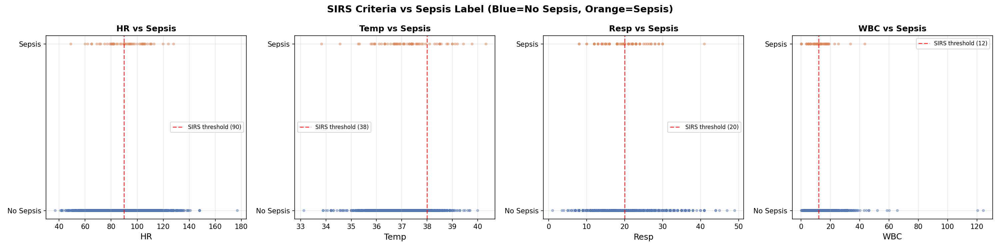
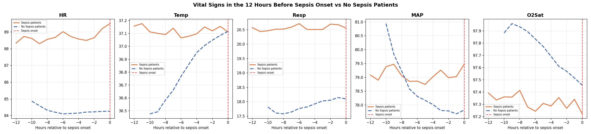

In my [first post](../Introduction/index.qmd), I explained why sepsis is so hard to catch early and why machine learning could help. In this post I'll walk through exactly how I built the model: the messy data, the engineering decisions, and the trade offs along the way.

## The Dataset

The data comes from the PhysioNet Computing in Cardiology Challenge 2019 — a publicly available dataset of **20,336 de-identified ICU patients** from two US hospital systems. Each patient file contains one row per hour in the ICU, with columns for vital signs, lab values, and demographics.

After combining all 20,336 files into one dataframe, I had **790,215 rows and 42 columns**. That's every hourly ICU reading across all patients, a complete picture of what it looks like to monitor someone in critical care.

One important detail about the labels: the PhysioNet challenge shifts `SepsisLabel` six hours ahead of clinical diagnosis. This means when the label flips to 1, it's already 6 hours before a doctor would officially recognize sepsis. This means that if my model predicted Sepsis with 3 hours of advance for patient X, it was actually 9 hours before the actual diagnosis. 

## The Mess: Missing Values

Vital signs like heart rate and blood pressure are recorded continuously by bedside monitors, but even those have gaps when monitors are disconnected or recalibrated. Lab values like lactate, WBC, and creatinine are drawn periodically, sometimes once a day, sometimes less — so entire stretches of a patient's stay have no lab readings at all.

Here's what the missingness looked like across key columns:

- `HR` — 7.7% missing
- `Temp` — 66% missing
- `Lactate` — 97% missing
- `EtCO2` — 100% missing (completely empty)

Five columns — `EtCO2`, `TroponinI`, `Bilirubin_direct`, `Fibrinogen`, and `Bilirubin_total` — were more than 80% missing. These were dropped entirely. The rest were handled through forward filling.

## Forward Fill: What It Is and Why Not Interpolation

For vital signs, I used **forward fill** — carrying the last known reading forward in time within each patient's hourly record.

If a patient's heart rate was recorded as 97 at hour 2 and the next reading wasn't until hour 5, hours 3 and 4 get filled with 97. The assumption is that the last known value is the best estimate of what was happening in the interim.

A natural question is why not use **linear interpolation** — gradually transitioning between the hour 2 value and the hour 5 value. Interpolation is more mathematically elegant, but it has a fundamental problem in this context: it uses future information to fill past values. At hour 3, you wouldn't actually know what the hour 5 reading would be. Using that future data to fill the gap would be **data leakage** — the model would be trained on information it couldn't have in real deployment. Forward fill avoids this entirely.

Lab values like lactate and creatinine were left with their remaining NaNs after forward filling. XGBoost handles missing values natively, so these don't need to be filled.

## Feature Engineering: Teaching the Model to See Trends

The single most important insight driving the feature engineering was this: **a snapshot is less informative than a trend**.

A heart rate of 102 bpm is mildly elevated. A heart rate that has risen from 82 to 102 over the last 6 hours is a warning sign. The raw value doesn't tell that story — the rate of change does.

For each of the five key vitals (HR, Temp, Resp, MAP, O2Sat), I created two new features using a 6-hour rolling window:

**Rolling average** — the mean of the last 6 hourly readings. This smooths out noise and captures the sustained level of a vital sign rather than a one-off spike.

**Rate of change** — the difference between the current reading and the reading 6 hours ago. A positive value means the vital is rising; negative means it's falling. This is the early warning signal.

I also encoded three established clinical scores directly as features:

**SIRS Score** — counts how many of the four SIRS criteria are met at each hour (HR > 90, Temp > 38 or < 36, Resp > 20, WBC > 12 or < 4). This is the same checklist nurses already use — turning it into a single number gives the model a compact summary of clinical risk.

**Shock Index** — heart rate divided by systolic blood pressure. Normal is around 0.5. Above 1.0 indicates significant cardiovascular stress. This ratio captures something neither HR nor SBP captures alone.

**Pulse Pressure** — systolic minus diastolic blood pressure. A narrowing pulse pressure indicates the heart is struggling to maintain output.

The scatter plots below show each SIRS variable against the sepsis label. Notice how no single variable cleanly separates the two groups — this is exactly why machine learning is needed over simple threshold rules.

## The Early Signal

Before modeling, the EDA revealed something critical. When I aligned all sepsis patients to their onset time and looked at the 12 hours before the label flipped, their vitals were already diverging from non-sepsis patients — from the very beginning of the window.

This is known as **label uncertainty** — the label marks when sepsis was recognized, not when it started. The physiological deterioration precedes the diagnosis. Combined with the 6-hour label shift already built into the dataset, the detectable signal begins approximately **18 hours before clinical recognition**.

## The Class Imbalance Problem

Of the 20,336 patients in the dataset, only 1,790 — about 8.8% — ever develop sepsis. At the row level, since most hours for even sepsis patients are labeled 0, the sepsis rate drops to just **2.2%**. For every sepsis row the model sees during training, it sees 45 non-sepsis rows.

If left unaddressed, the model would learn to predict "no sepsis" for everything and achieve 97.8% accuracy while being completely useless clinically.

XGBoost handles this through a parameter called `scale_pos_weight`, which instructs the model to treat each sepsis row as if it were 45 non-sepsis rows. This forces the model to pay equal attention to both classes despite the imbalance.

## Why XGBoost

I trained two models: a logistic regression as a baseline, and XGBoost as the primary model.

Logistic regression is a linear model — it can only find straight-line relationships between features and outcome. Sepsis risk doesn't work that way. A heart rate of 90 combined with rising lactate and dropping blood pressure is far more dangerous than any of those values in isolation. Capturing that interaction requires a non-linear model.

XGBoost is a gradient boosting algorithm that builds an ensemble of decision trees, with each tree correcting the errors of the previous ones. It has two specific advantages for this problem: it handles missing values natively (important given how sparse the lab data is), and it captures complex non-linear interactions between features automatically.

One important methodological note on the train/test split: I split at the **patient level**, not the row level. This means every row for a given patient ended up entirely in the training set or entirely in the test set — never both. A row-level split would allow the model to see hour 1-40 of a patient during training and then predict hours 41-54 in the test set. Since the model has already seen that patient, this inflates performance metrics. Patient-level splitting gives a more honest estimate of how the model would perform on genuinely new patients.

## SHAP: Opening the Black Box

A model that outputs a risk score but can't explain it is not useful in a clinical setting. A nurse who sees "HIGH RISK" without knowing which vitals are driving that alert has no clear action to take.

SHAP (SHapley Additive exPlanations) solves this by assigning each feature a contribution score for every individual prediction. A positive SHAP value means that feature pushed the risk score up; a negative value means it pushed it down.

The top features by importance were ICULOS (hours in ICU), HospAdmTime, ICU unit type, respiratory rate rolling average, age, temperature, and blood pressure. Several of the engineered features — particularly `Resp_rolling6` and `MAP_rolling6` — ranked in the top 10, validating the time-based feature engineering approach.

One finding worth flagging: ICULOS (hours in the ICU) ranking as the most important feature suggests the model is partly learning that patients who stay longer are more likely to develop sepsis — a real but not entirely actionable signal. This is an area for future refinement.

## What's Next

In the third and final blog post, I'll share the model's performance results, walk through the clinical evaluation — including how we measured hours of early detection — and reflect on what are the limitations and considerations of the results.

---

*The full code for this project is available at [https://github.com/leonardoalva98/senior_project/tree/main/code] Dataset: PhysioNet CinC Challenge 2019.*
