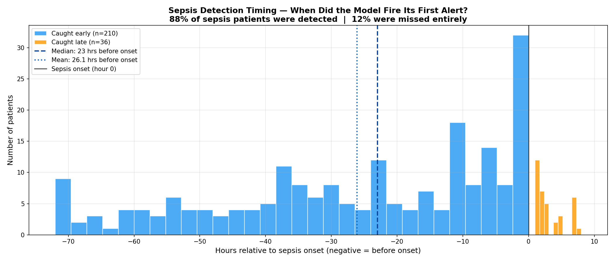
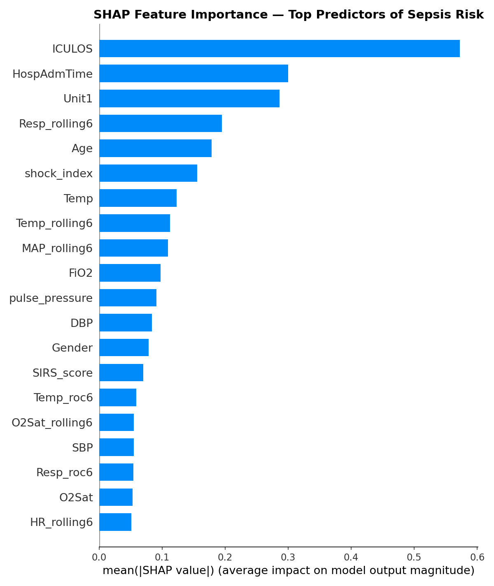

In this final post I'll share the results, explain what the model actually learned, and reflect honestly on the limitations and lessons from building this project.

## The Results

I trained two models and compared them directly:

| Metric | Logistic Regression | XGBoost |
|--------|-------------------|---------|
| AUC | 0.742 | **0.885** |
| Recall (sepsis) | 0.61 | **0.73** |
| Precision (sepsis) | 0.05 | **0.10** |
| Clinical Precision | - | **0.49** |

XGBoost significantly outperformed the linear baseline across every metric. AUC improved from 0.742 to 0.885 — meaning the model correctly ranks a sepsis patient as higher risk than a non-sepsis patient 88.5% of the time.

Recall of 0.73 means the model catches 73% of actual sepsis cases, the most important metric in a clinical context where missing a case is far more dangerous than a false alarm.

## Why Standard Metrics Mislead

The precision number deserves a careful explanation.

Standard precision of 0.10 means that for every 10 alerts the model fires, only 1 corresponds to a row officially labeled as sepsis. That sounds bad. But it misses something important.

The `SepsisLabel` in this dataset flips to 1 at a specific hour — but sepsis doesn't begin at that exact moment. The physiological deterioration starts hours before the official diagnosis. When the model fires an alert at hour 37 and the label doesn't flip until hour 41, the standard metric counts that as a false positive. Clinically, it's an early correct detection.

To measure this more honestly, I re-evaluated the model against patient-level outcomes, whether each patient eventually developed sepsis at any point during their stay, regardless of timing. Under this evaluation, precision improves from 0.10 to **0.49**. Nearly half of the model's alerts correspond to patients who genuinely develop sepsis.

This is a more clinically meaningful way to evaluate a sequential prediction model. The label timing problem is a known limitation of standard evaluation metrics applied to sepsis prediction.

## How Early Did the Model Actually Detect?

This was the most important question — not just whether the model was right, but how early.

For each patient in the test set, I measured the first hour the model fired an alert and compared it to the official onset hour. Filtering for clinically meaningful detections within a 48-hour window:

- **210 patients** caught meaningfully early
- **Average: 26.1 hours** before the label flipped
- **Median: 23 hours** before the label flipped

Adding the 6-hour label shift already built into the dataset, the median early detection translates to approximately **29 hours before clinical diagnosis**.

Of the 358 total sepsis patients in the test set:

- **78%** were caught before onset
- **10%** were caught at or after onset  
- **12%** were missed entirely

## What the Model Actually Learned — SHAP

The SHAP analysis revealed which features drove predictions most strongly. The top predictors were:

**ICULOS** (hours in ICU) ranked first by a large margin. This deserves scrutiny, it means the model is partly learning that patients who stay in the ICU longer are more likely to develop sepsis. That's statistically true but not entirely actionable. A nurse can't intervene on how long a patient has been in the ICU. This is a legitimate limitation and a direction for future work.

**Shock index** ranked 4th — validating the composite feature engineering. The ratio of HR to SBP captured something neither raw HR nor SBP captured alone.

**Resp_rolling6** ranked 7th — the 6-hour rolling respiratory rate average was more predictive than raw Resp, confirming that trends matter more than snapshots.

**SIRS_score** appeared in the top 10 — the clinically validated checklist that nurses already use was meaningful to the model as well, providing a useful sanity check.

**Age** ranked 10th — older patients carry higher sepsis risk, consistent with clinical literature.

## Limitations

I want to be honest about what this model cannot do.

**Single hospital system generalization.** The PhysioNet challenge showed that models trained on data from two hospital systems performed significantly worse on a third hidden hospital system. My model was trained on data from Beth Israel Deaconess Medical Center. It would need revalidation before being applied at any other institution.

**ICULOS dominance.** As discussed above, the model's heaviest reliance on time-in-ICU rather than vital sign patterns limits its actionability. A better approach would be to train only on the hours before onset, forcing the model to learn from physiological signals rather than temporal patterns.

**Label uncertainty.** The Sepsis-3 definition requires both clinical suspicion and organ dysfunction to be confirmed retrospectively. The label marks when sepsis was recognized, not when it began. This means the model is predicting a conservative, retrospective estimate of onset, the true physiological signal likely starts even earlier.

**No external validation.** The model has never been tested on patients outside the PhysioNet dataset. Any real-world deployment would require prospective validation in a clinical setting.

## What I Would Do Differently

If I were to extend this project, the highest-value improvements would be:

Train on pre-onset hours only — excluding post-onset rows from training to force the model to learn early warning patterns rather than confirming an already-deteriorating patient.

Add a temporal model — XGBoost treats each row independently. A recurrent neural network or transformer architecture could learn sequential patterns across hours more naturally, potentially improving early detection.

Systematic hyperparameter tuning — I used near-default XGBoost settings. A structured search using Optuna could squeeze out additional performance, particularly on the precision-recall tradeoff.

Patient-level cross-validation — instead of a single train/test split, k-fold cross-validation at the patient level would give a more robust estimate of model performance.

## Final Reflection

This project started as a portfolio piece and became something more interesting — a genuine 
encounter with the messiness of real clinical data and the gap between a working model and 
a deployable tool.

The hardest parts were not technical. They were conceptual: understanding why forward fill 
is more honest than interpolation, why the standard precision metric misleads in a sequential 
prediction setting, why ICULOS dominating SHAP is a problem worth acknowledging rather than 
hiding.

A model with 0.885 AUC catching sepsis a median of 23 hours before the label flips — 
approximately 29 hours before clinical diagnosis — is genuinely promising. The path from 
here to a system a nurse would actually trust and use is long and complex. But the signal 
is there.

## What I Would Do Next

If I were to continue this project, the next steps would be:

**Train on both hospital datasets.** This project used only training set A (Beth Israel 
Deaconess Medical Center). The PhysioNet challenge also includes training set B from Emory 
University Hospital. Training on both would expose the model to more diverse patient 
populations and likely improve generalization.

**Explore neural network architectures.** XGBoost treats each row independently. A 
recurrent neural network (LSTM) or transformer architecture could learn sequential patterns 
across hours more naturally, potentially catching earlier and subtler trends.

**Patient-level cross-validation.** Instead of a single train/test split, k-fold 
cross-validation at the patient level would give a more statistically robust estimate 
of model performance.

**Address ICULOS dominance.** Training only on pre-onset hours would force the model to 
learn from physiological signals rather than relying on how long a patient has been in 
the ICU.
---

*The full code, notebooks, and analysis for this project are available at [https://github.com/leonardoalva98/senior_project/blob/main/code]. Dataset: PhysioNet CinC Challenge 2019.*
